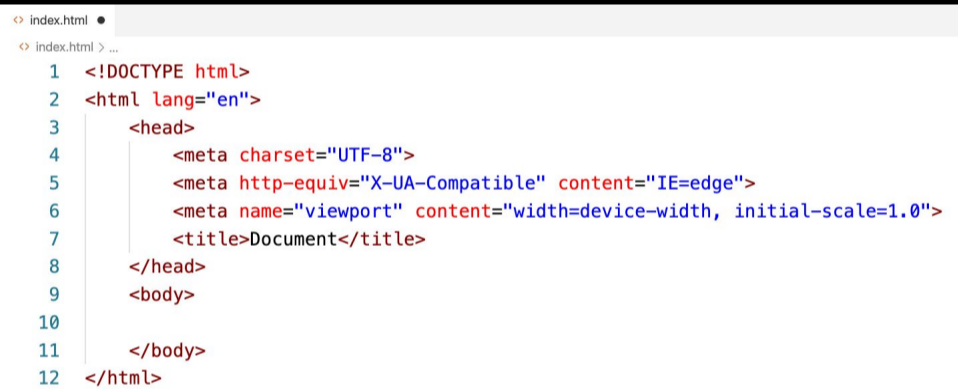
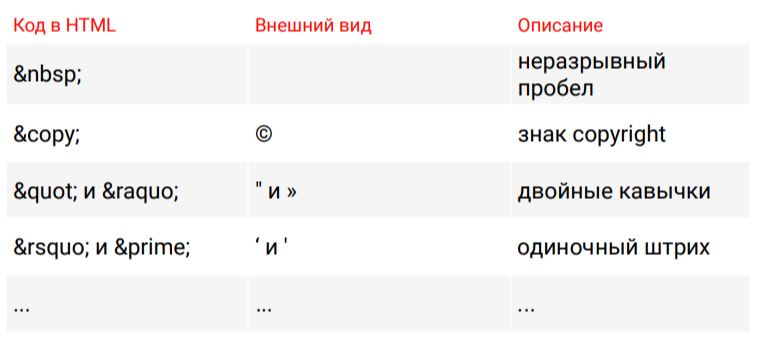

# Теги
### Парные теги 
<название_тега>текст внутри
тега</название_тега> 

    1. 
Текста параграфа
.

    2. <b>Жирнýй текст</b>.

    3. <i>Курсивнýй текст</i>.
##

### Одиночные теги
<название_тега> 

    1.   – перенос строки (break). 

    2. 
 – горизонталþнаā черта (horizontal rule).
##
### Атрибуты тегов

    <название_тега 
    атрибут1=“значение_атрибута1”>
        текст внутри тега
    </название_тега >

    Пример:
    <a href=”contacts.html” >Контакты</a>
    

### <u>ВАЖНО</u>

**Название тега и атрибута – строчными буквами.**

**Значение атрибута – строчными буквами и в двойных кавычках.**

**Парный тег – обязательно закрыт**
##

# Структура HTML-документа

##
# Спецсимволы

##
Продолжить с 52:17

to be continued